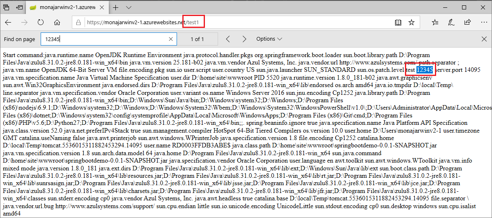

# springbootdemo
For V1 javase web app test

## Details
- Deplymeny type: JAR

## How to test custom java options for Windows Java SE app service
1. Deploy JAR package to javase web app
2. Open the web app URL and access the context path: /test1
3. Check the JAVA_OPTS argument are added into web app start arguments like below:

